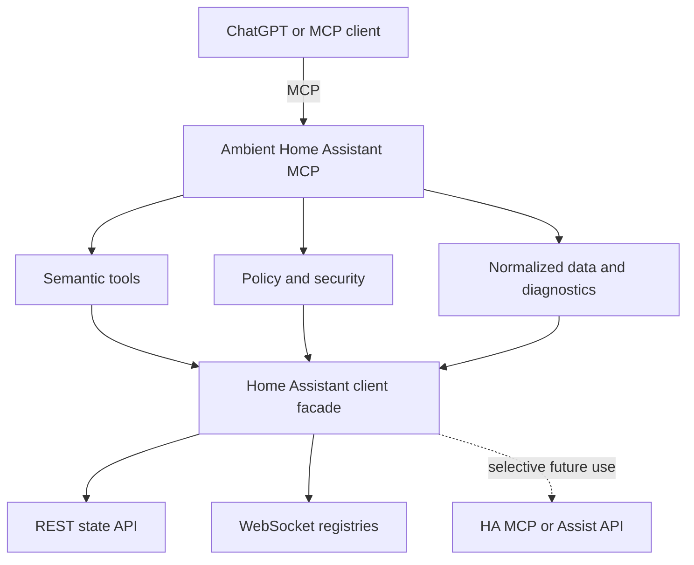

# Ambient Home Assistant MCP

Ambient Home Assistant MCP is a secure, semantic bridge that gives ChatGPT and
other MCP clients purpose-built access to Home Assistant. It is the server
foundation for the future user-facing **Ambient Home Assistant** application.

> **Phase 5 status:** local/private and read-only. This release adds automation
> discovery, bounded stored-trace analysis, static reference indexing, and strict
> causality evidence. It cannot run, enable, edit, or create automations and cannot
> control devices. Phase 3.5/5 live validation remains blocked solely
> because the required Home Assistant URL and token were unavailable; no
> production-validation claim is made.

## What it is—and what it is not

The bridge is an abstraction and security layer. Over time, it can choose among
Home Assistant REST, WebSocket, and native MCP/Assist interfaces while presenting
small, semantic tools to the model.

It is **not**:

- a replacement for Home Assistant;
- an unrestricted Home Assistant administrator API;
- a generic API wrapper exposed to an LLM; or
- a reverse proxy for Home Assistant's `/api/mcp` endpoint.

## Architecture



MCP tools never make raw HTTP requests. They depend on `HomeAssistantClient`,
which owns interface selection and immediately normalizes upstream responses.
See [the architecture decision record](docs/architecture.md).

## Capabilities

| Surface | Purpose |
| --- | --- |
| `ha_connection_status` | Reports reachability and authentication state without exposing credentials. |
| `ha_server_info` | Returns only version, time zone, and unit-system metadata. |
| `ha_get_entity` | Gets one current entity by exact entity ID with resolved location and safe attributes. |
| `ha_search_entities` | Searches current entities by name/ID and composable domain, area, floor, state, and availability filters. |
| `ha_list_areas` / `ha_get_area` | Lists compact areas or gets one area with domain counts and an optional bounded entity list. |
| `ha_list_floors` / `ha_get_floor` | Lists floors or gets one floor with area and domain aggregates. |
| `ha_domain_summary` | Summarizes observed states and availability for any entity domain. |
| `ha_get_entity_history` | Returns bounded recorded state transitions and only proven state durations. |
| `ha_get_logbook` | Returns bounded, privacy-filtered recorded logbook facts. |
| `ha_get_recent_changes` | Finds recorded state changes by time, area, floor, domain, or entity. |
| `ha_get_home_summary` | Returns a bounded whole-home snapshot containing only supported sections. |
| `ha_find_unavailable_entities` | Finds unavailable entities with optional factual duration filtering. |
| `ha_find_low_batteries` | Finds genuine numeric percentage battery sensors below a threshold. |
| `ha_get_openings` | Lists doors, windows, garage doors, and other openings by semantic class. |
| `ha_get_lights_on` | Lists compact current light entities reporting `on`. |
| `ha_diagnose_home` | Returns deterministic, evidence-backed findings with exact severities. |
| `ha_list_automations` | Lists compact current automation metadata with deterministic search. |
| `ha_get_automation` | Returns a bounded, sanitized loaded automation definition when supported. |
| `ha_find_automations_for_entity` | Finds conservative static entity/device/template references. |
| `ha_get_automation_traces` | Lists compact metadata for recent stored automation traces. |
| `ha_get_automation_trace` | Normalizes one bounded stored execution trace with nested paths. |
| `ha_find_activity_cause` | Correlates Recorder contexts, traces, static references, and timing under strict evidence rules. |
| `GET /health` | Reports application liveness and separate Home Assistant readiness. |

No service calls, state changes, or administrative endpoints are implemented.

## Security model

- Home Assistant tokens come only from runtime configuration and use Pydantic
  secret types.
- Logs are structured and redact bearer tokens and common credential fields.
- Raw `/api/config` data is reduced to an allowlisted model before it can reach a
  tool result.
- Detailed entity attributes use an explicit allowlist and exclude URLs, camera
  sources, tokens, credentials, coordinates, and location-bearing metadata.
- Current states are never cached. Registry metadata uses one bounded 60-second
  TTL cache to avoid repeated WebSocket authentication and registry reads.
- Historical queries use Home Assistant Recorder data, remain uncached, and are
  bounded to a 24-hour default / 7-day maximum window, 500 events, and 50
  aggregate candidate entities by default.
- Whole-home tools use one bulk current-state request plus the registry cache.
  Detail lists are bounded, raw tracker attributes are excluded, and safety text
  states only what Home Assistant reports.
- Automation definitions use Home Assistant's admin-gated `automation/config`
  WebSocket command. Stored traces use `trace/list`, `trace/get`, and
  `trace/contexts`; unavailable commands degrade only those features.
- Automation aliases, descriptions, templates, and action data are untrusted data.
  Strings and structures are bounded, secret-like values and private action content
  are redacted, Jinja is never executed, and context user IDs are never returned.
- The reference index is an in-memory TTL snapshot with explicit refresh and a
  500-automation bound. Current automation entity metadata and Recorder state
  changes remain fresh.
- MCP transport Host and Origin allowlists protect against DNS rebinding.
- The policy engine allows reads and fails closed for every control class.
- The container runs as a non-root user with a read-only filesystem in Compose.

Never commit `.env`, Home Assistant tokens, credentials, private URLs, or
certificates. See [Security](docs/security.md) before any deployment work.

## Quick start

Requirements: Python 3.12+ and [uv](https://docs.astral.sh/uv/).

```bash
cp .env.example .env
# Edit .env and provide HOME_ASSISTANT_URL and HOME_ASSISTANT_TOKEN.
uv sync --all-extras
uv run ambient-ha-mcp
```

The Streamable HTTP MCP endpoint is `http://127.0.0.1:8000/mcp`; health is at
`http://127.0.0.1:8000/health`.

Inspect the tools locally:

```bash
npx @modelcontextprotocol/inspector@latest
```

Then connect the Inspector to `http://127.0.0.1:8000/mcp`.

## Development commands

```bash
uv sync --all-extras          # install
uv run ambient-ha-mcp         # run locally
uv run pytest                 # unit tests; real HA tests skip by default
uv run ruff check .           # lint
uv run ruff format --check .  # formatting check
uv run mypy                   # type check
docker build -t ambient-ha-mcp .
docker compose up --build
```

Regenerate the dependency lock after an intentional dependency change:

```bash
uv lock
```

## Docker Compose

Copy `.env.example` to `.env`, supply the two required Home Assistant settings,
and run `docker compose up --build`. Compose publishes only to host loopback.

The Docker health probe tests **application liveness**. A temporary Home Assistant
outage changes `/health` to `status: degraded`, but leaves HTTP status 200 so the
orchestrator does not restart a healthy bridge in a loop.

## Documentation

- [Architecture](docs/architecture.md)
- [Security](docs/security.md)
- [Tool contracts](docs/tools.md)
- [Development](docs/development.md)
- [ChatGPT setup and current limitations](docs/chatgpt-setup.md)

## License

MIT. See [LICENSE](LICENSE).
