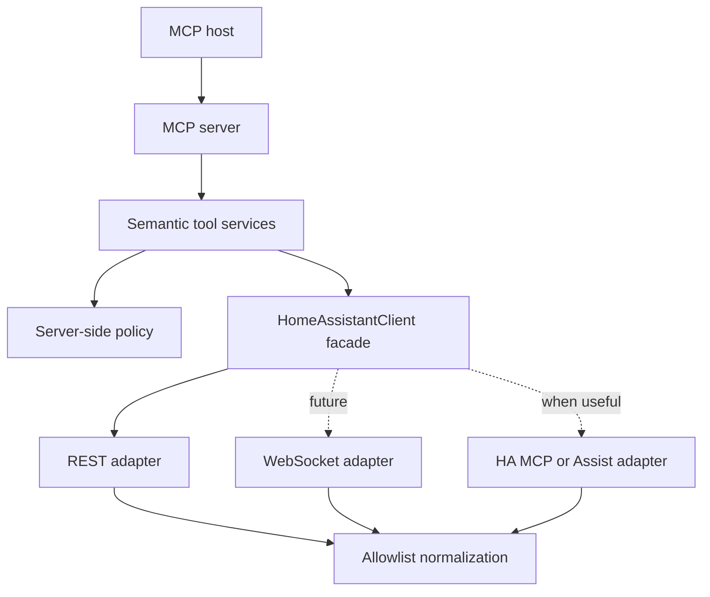

# Architecture

## Decision summary

Ambient Home Assistant MCP is a semantic application layer, not a transport
proxy. Its stable boundary is a set of model-friendly tools; Home Assistant API
selection is an internal implementation detail.

## Layer responsibilities

### MCP server

Defines tool names, model-oriented descriptions, structured output schemas, and
transport behavior. It contains no Home Assistant URLs, HTTP calls, or policy
rules. Plain HTTP health is intentionally unauthenticated and returns no private
installation data.

### Semantic tool services

Represent user goals such as diagnosing connectivity. Later tools should follow
the same pattern: `get_home_summary`, `search_entities`, `get_entity_history`,
`get_recent_changes`, and narrowly scoped controls. A generic `call_ha_api` or
`call_service` tool is explicitly outside the architecture.

### Policy engine

Makes authorization decisions on the server, independently of any MCP-host
confirmation UI. Phase 1 allows `read` and denies normal control, sensitive
control, and administrative operations. Later decisions can include identity,
entity/domain allowlists, location/area rules, time constraints, and audit data.

### HomeAssistantClient

Is the semantic facade used by application services. It will coordinate:

- REST for simple snapshots, history, logbook, and selected safe operations;
- WebSocket for registries, automation traces, event streams, and efficient live
  state; and
- Home Assistant MCP/Assist only where its semantics are useful.

No MCP tool should depend directly on `httpx`, WebSocket command types, or a raw
Home Assistant payload.

### Normalization

Raw payloads are reduced to typed allowlist models immediately. Denylisting a few
sensitive fields is insufficient because upstream payloads evolve. Phase 1's
`/api/config` response exposes only version, time zone, and unit-system strings;
coordinates, filesystem paths, components, URLs, and unknown fields are dropped.

## Phase 1 request flow

1. An MCP client calls one of two diagnostic tools.
2. The tool service calls `HomeAssistantClient`.
3. The client chooses the REST adapter for `GET /api/` or `GET /api/config`.
4. The adapter maps network, TLS, timeout, authentication, HTTP, and JSON failures
   to stable exceptions with secret-free messages.
5. The client/tool returns a typed diagnostic result.

## Health semantics

`GET /health` always describes three separate facts:

- `application_running` — the ASGI application handled the request;
- `home_assistant_reachable` — an upstream connection succeeded; and
- `home_assistant_authenticated` — Home Assistant accepted the configured token.

HTTP 200 means the bridge process is live. `status: degraded` means Home Assistant
readiness is impaired. Docker therefore does not restart a healthy bridge merely
because Home Assistant is restarting or temporarily offline.

## Planned extension rules

- Add a semantic client method before adding a tool that needs it.
- Select the safest HA interface inside the client, not inside the tool.
- Normalize every upstream payload before returning it.
- Classify every write operation in the policy engine before implementation.
- Keep read and write tools narrow; never add an unrestricted escape hatch.
- Add audit events before enabling control.
- Treat locks, alarms, garage doors, cameras, presence, and administrative changes
  as sensitive by default.

