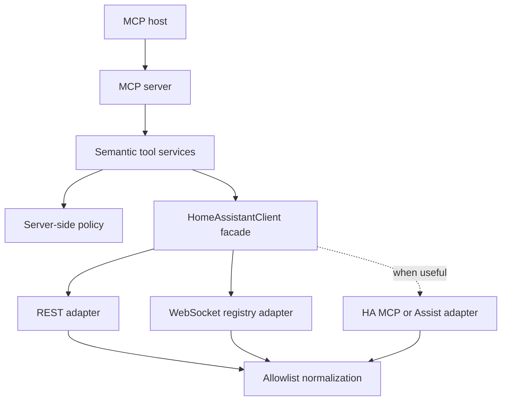

# Architecture

## Decision summary

Ambient Home Assistant MCP is a semantic application layer, not a transport
proxy. Its stable boundary is a set of model-friendly tools; Home Assistant API
selection is an internal implementation detail.

## Layer responsibilities

### MCP server

Defines tool names, model-oriented descriptions, structured output schemas, and
transport behavior. It contains no Home Assistant URLs, HTTP calls, or policy
rules. Plain HTTP health is intentionally unauthenticated and returns no private
installation data.

### Semantic tool services

Represent user goals such as diagnosing connectivity, resolving an entity,
searching a home's semantic inventory, reading recorded facts, and summarizing
areas or floors. Later tools should follow the same pattern: `get_home_summary`,
and narrowly scoped controls. A generic `call_ha_api` or
`call_service` tool is explicitly outside the architecture.

### Policy engine

Makes authorization decisions on the server, independently of any MCP-host
confirmation UI. The current engine allows `read` and denies normal control, sensitive
control, and administrative operations. Later decisions can include identity,
entity/domain allowlists, location/area rules, time constraints, and audit data.

### HomeAssistantClient

Is the semantic facade used by application services. It coordinates:

- REST for fresh current-state snapshots and selected safe metadata;
- REST for official Recorder history and logbook reads; and
- WebSocket for entity, device, area, and floor registry snapshots; and
- Home Assistant MCP/Assist only where its semantics are useful.

No MCP tool should depend directly on `httpx`, WebSocket command types, or a raw
Home Assistant payload.

### Normalization

Raw payloads are reduced to typed allowlist models immediately. Denylisting a few
sensitive fields is insufficient because upstream payloads evolve. The
`/api/config` response exposes only version, time zone, and unit-system strings;
coordinates, filesystem paths, components, URLs, and unknown fields are dropped.

Entity search and list results use compact typed summaries with no attributes.
Single-entity details include at most 40 explicitly allowlisted attributes;
strings, nested collections, and list sizes are bounded, and privacy-bearing
keys and URL values are removed.

## Discovery request flow

1. An MCP client calls a semantic discovery tool.
2. The tool service validates and bounds its arguments, then calls `HomeAssistantClient`.
3. The client fetches current states over REST and registry metadata over an
   authenticated WebSocket connection. Registry metadata is cached for 60 seconds;
   states are always fresh.
4. The resolver joins entity registry → device registry → area registry → floor
   registry. An entity's own area wins over its device's inherited area.
5. The adapters map network, TLS, timeout, authentication, HTTP, and JSON failures
   to stable exceptions with secret-free messages.
6. The tool returns a compact typed result with explicit not-found, unsupported,
   and truncation metadata.

Search normalizes case and punctuation, matches entity IDs, object IDs, friendly
names, devices, areas, and floors, and applies all supplied filters together.
Entity/object/name matches rank above contextual area/floor matches. Final ordering
is deterministic.

Registry command absence is feature-local: older installations can return
`supported: false` for floors or areas without collapsing unrelated discovery.

## Historical request flow

Phase 3 uses the official read-only REST endpoints `GET /api/history/period` and
`GET /api/logbook`. `HomeAssistantClient` validates offset-aware ISO-8601 windows,
applies the configured lookback/event/entity bounds, makes one bulk history request
for aggregate changes, and normalizes the response before a tool sees it. No
historical data is cached.

Recorder results can be partial because retention, exclusions, purges, and disabled
Recorder/logbook components are normal installation conditions. Empty history is a
successful factual result. State duration is emitted only when both the beginning
and the next recorded boundary are inside the requested window.

The normalizer preserves opaque state/logbook context IDs and parent IDs for a
future causality layer, but Phase 3 neither resolves them nor explains why an event
happened. Context user identifiers are not returned.

## Health semantics

`GET /health` always describes three separate facts:

- `application_running` — the ASGI application handled the request;
- `home_assistant_reachable` — an upstream connection succeeded; and
- `home_assistant_authenticated` — Home Assistant accepted the configured token.

HTTP 200 means the bridge process is live. `status: degraded` means Home Assistant
readiness is impaired. Docker therefore does not restart a healthy bridge merely
because Home Assistant is restarting or temporarily offline.

## Planned extension rules

- Add a semantic client method before adding a tool that needs it.
- Select the safest HA interface inside the client, not inside the tool.
- Normalize every upstream payload before returning it.
- Classify every write operation in the policy engine before implementation.
- Keep read and write tools narrow; never add an unrestricted escape hatch.
- Add audit events before enabling control.
- Treat locks, alarms, garage doors, cameras, presence, and administrative changes
  as sensitive by default.
