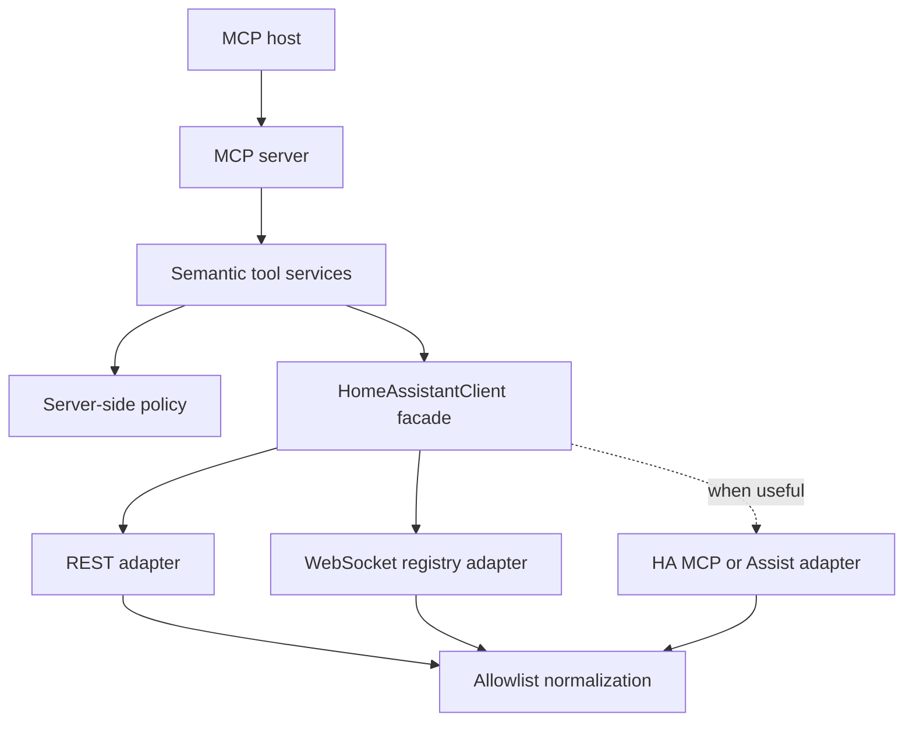
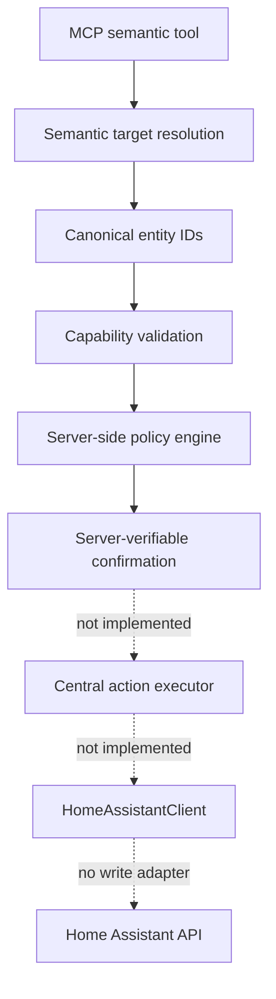

# Architecture

## Decision summary

Ambient Home Assistant MCP is a semantic application layer, not a transport
proxy. Its stable boundary is a set of model-friendly tools; Home Assistant API
selection is an internal implementation detail.

## Layer responsibilities

### MCP server

Defines tool names, model-oriented descriptions, structured output schemas, and
transport behavior. It contains no Home Assistant URLs, HTTP calls, or policy
rules. Plain HTTP health is intentionally unauthenticated and returns no private
installation data.

### Semantic tool services

Represent user goals such as diagnosing connectivity, resolving an entity,
searching a home's semantic inventory, reading recorded facts, and summarizing
areas, floors, or the whole home. Later tools should follow the same pattern for
narrowly scoped controls. A generic `call_ha_api` or
`call_service` tool is explicitly outside the architecture.

### Policy engine

Makes authorization decisions on the server, independently of any MCP-host
confirmation UI and independently of the Home Assistant credential's upstream
privilege. Phase 6 models `allow`, `deny`, and `confirm_required`; canonical
resolved targets; protected-entity, entity, domain, operation, and global rules;
typed value bounds; mass-action limits; confirmation requirements; dry-run plans;
and redacted audit events. There is still no action executor or write-capable
client method.

Exact precedence is:

1. hard `READ_ONLY` boundary;
2. hard administrative prohibition;
3. protected entity;
4. explicit entity rule;
5. domain rule;
6. operation-class rule; and
7. global default.

Policy never consumes friendly names, aliases, template text, trace messages, or
other Home Assistant natural-language data. Area and floor IDs are carried as
canonical planning metadata, but area/floor authorization rules are deferred until
they can be integrated without fragile display-name matching.

### HomeAssistantClient

Is the semantic facade used by application services. It coordinates:

- REST for fresh current-state snapshots and selected safe metadata;
- REST for official Recorder history and logbook reads; and
- WebSocket for entity, device, area, and floor registry snapshots;
- WebSocket for loaded automation configuration and stored automation traces; and
- Home Assistant MCP/Assist only where its semantics are useful.

No MCP tool should depend directly on `httpx`, WebSocket command types, or a raw
Home Assistant payload.

### Runtime adapters

One container image and Python implementation serve both deployment modes. The
`ambient_ha.launcher` selects an adapter before settings are loaded:

- `standalone` preserves the existing `HOME_ASSISTANT_URL` and
  `HOME_ASSISTANT_TOKEN` environment contract; and
- `home_assistant_app` reads only allowlisted, bounded values from
  `/data/options.json`, obtains `SUPERVISOR_TOKEN` from the App environment, and
  explicitly targets the official REST proxy at `http://supervisor/core` and
  WebSocket proxy at `ws://supervisor/core/websocket`.

Supervisor owns its App options document with root-only permissions. The image
therefore starts a bounded bootstrap as container root, reads and validates the
options, and then changes supplementary groups, GID, and UID to the fixed
`ambient` account before the shared server starts. Compose bypasses the bootstrap
identity by starting directly as `ambient`. Application request handling never
runs as root.

App mode overwrites any inherited Home Assistant URL/token, hard-forces
`READ_ONLY=true`, clears `POLICY_FILE`, binds inside the isolated App network, and
allows no browser origins. The Home Assistant App definition keeps its host port
disabled by default. The same REST and WebSocket adapters use runtime-supplied
transport endpoints through Supervisor's Core proxy; no parallel Home Assistant
client exists. Standalone mode continues to derive `/api/websocket` from its
configured HTTP(S) Home Assistant base URL.

The App requests only `homeassistant_api`. It does not request Supervisor API,
Docker, host networking, ingress, host filesystem maps, hardware privileges, or
full access. GitHub Actions build the root Docker context into per-architecture
images and publish a generic multi-architecture manifest whose tag matches the
App `version`.

### Normalization

Raw payloads are reduced to typed allowlist models immediately. Denylisting a few
sensitive fields is insufficient because upstream payloads evolve. The
`/api/config` response exposes only version, time zone, and unit-system strings;
coordinates, filesystem paths, components, URLs, and unknown fields are dropped.

Entity search and list results use compact typed summaries with no attributes.
Single-entity details include at most 40 explicitly allowlisted attributes;
strings, nested collections, and list sizes are bounded, and privacy-bearing
keys and URL values are removed.

## Discovery request flow

1. An MCP client calls a semantic discovery tool.
2. The tool service validates and bounds its arguments, then calls `HomeAssistantClient`.
3. The client fetches current states over REST and registry metadata over an
   authenticated WebSocket connection. Registry metadata is cached for 60 seconds;
   states are always fresh.
4. The resolver joins entity registry → device registry → area registry → floor
   registry. An entity's own area wins over its device's inherited area.
5. The adapters map network, TLS, timeout, authentication, HTTP, and JSON failures
   to stable exceptions with secret-free messages.
6. The tool returns a compact typed result with explicit not-found, unsupported,
   and truncation metadata.

Search normalizes case and punctuation, matches entity IDs, object IDs, friendly
names, devices, areas, and floors, and applies all supplied filters together.
Entity/object/name matches rank above contextual area/floor matches. Final ordering
is deterministic.

Registry command absence is feature-local: older installations can return
`supported: false` for floors or areas without collapsing unrelated discovery.

## Historical request flow

Phase 3 uses the official read-only REST endpoints `GET /api/history/period` and
`GET /api/logbook`. `HomeAssistantClient` validates offset-aware ISO-8601 windows,
applies the configured lookback/event/entity bounds, makes one bulk history request
for aggregate changes, and normalizes the response before a tool sees it. No
historical data is cached.

Recorder results can be partial because retention, exclusions, purges, and disabled
Recorder/logbook components are normal installation conditions. Empty history is a
successful factual result. State duration is emitted only when both the beginning
and the next recorded boundary are inside the requested window.

The normalizer preserves opaque state/logbook context IDs and parent IDs for a
future causality layer, but Phase 3 neither resolves them nor explains why an event
happened. Context user identifiers are not returned.

## Whole-home diagnostic flow

Phase 4 tools each perform one bulk `GET /api/states` request and reuse the same
cached registry snapshot as discovery. `DiscoveryResolver` creates one normalized
inventory with sanitized attributes; the pure `HomeAnalyzer` then classifies and
aggregates it without additional network calls. No entity-by-entity request loop
is used.

Classification prioritizes Home Assistant domain, `device_class`, state, unit, and
capabilities. Conservative entity/friendly-name fallbacks are used only for
unclassified binary-sensor or cover openings. Battery findings require a `sensor`
with device class `battery`, unit `%`, and a numeric state between 0 and 100.

Whole-home responses contain counts and bounded evidence. Only supported sections
are emitted. Diagnostic findings are deterministic data with an exact category,
severity, cautious message, and state/device-class evidence; explanatory reasoning
remains the MCP client's responsibility.

## Automation intelligence flow

Phase 5 uses only authenticated, read-only Home Assistant interfaces:

- fresh `automation.*` states from `GET /api/states` supply enabled state,
  friendly name, last-triggered time, and mode;
- the admin-gated WebSocket `automation/config` command supplies each loaded
  automation's in-memory raw configuration;
- the admin-gated WebSocket `trace/list`, `trace/get`, and `trace/contexts`
  commands supply stored trace metadata, one requested trace body, and the
  context-to-trace lookup used for correlation; and
- the existing Recorder history path supplies state changes and opaque context
  IDs. Phase 5 does not create a parallel history implementation.

The exact WebSocket command contracts are version-sensitive Home Assistant Core
interfaces. Ambient feature-detects `unknown_command`, represents unsupported
features structurally, and does not let trace/configuration absence collapse
entity discovery or history. Configuration covers loaded automations, including
UI-managed entries, without assuming `automations.yaml`, reading `.storage`, or
accessing the Home Assistant filesystem.

An in-memory TTL catalog fetches loaded configurations in one bounded WebSocket
session and builds conservative static references. It is limited to 500 loaded
automations, expires with the registry-cache TTL, can be explicitly refreshed,
and is never persisted. Current automation states and traces are not stored in
that cache.

Trace normalization preserves Home Assistant path strings and recorded bucket
order, including nested `choose`, `if`, `parallel`, and sequence paths. It returns
at most 200 normalized steps. Configuration and trace values are recursively
bounded to eight levels, 100 items per collection, and 512 characters per string,
with a shared 2,000-value / 20,000-text-character normalization budget per result.

### Causality rules

`ha_find_activity_cause` gathers evidence; it does not generate a narrative.
The exact categories are:

- `confirmed_by_context`: the Recorder state-change context ID equals a stored
  automation trace context ID, or its parent context ID directly equals that
  trace context ID.
- `trace_confirmed`: a stored trace has an executed `action/...` step whose
  result contains an explicit `entity_id` target, and that action timestamp is
  within 10 seconds of the recorded state change.
- `strong_temporal_match`: a statically referencing automation has a trace inside
  the requested window, but neither direct context linkage nor the strict
  executed-target timing rule is present.
- `possible_reference`: static configuration references the entity, with no
  matching execution evidence.
- `user_origin`: Recorder included a user ID in the state context; Ambient emits
  only the origin category, never the identifier.
- `unrelated_or_unknown`: no supported automation evidence was found.

Only the first two automation categories carry `confidence: confirmed`. Timestamp
proximity and static references never do. Even confirmed evidence states what
Home Assistant recorded; it is not free-form proof about physical reality.

## Health semantics

`GET /health` always describes three separate facts:

- `application_running` — the ASGI application handled the request;
- `home_assistant_reachable` — an upstream connection succeeded; and
- `home_assistant_authenticated` — Home Assistant accepted the configured token.

HTTP 200 means the bridge process is live. `status: degraded` means Home Assistant
readiness is impaired. Docker therefore does not restart a healthy bridge merely
because Home Assistant is restarting or temporarily offline.

## Future write authorization flow

Phase 6 establishes—but does not activate—the following flow:

Authorization occurs only after resolution. A phrase such as “garage lights” is
never authorized and then expanded later. Ambiguous resolution yields a modeled
clarification requirement. A mixed-target plan explicitly separates allowed,
denied, and confirmation targets; any denial makes the overall plan deny so a
future executor cannot silently perform only a subset.

The internal `ActionPlanner` enforces target and operation limits before evaluating
individual rules, rejects unknown capabilities, applies value constraints without
clamping, sanitizes predicted service data, and always returns
`execution_available: false` / `executable: false`. Confirmation is represented as
an unverified server-challenge requirement; Phase 6 accepts no `confirmed=true`
input. `AuditEvent` and `AuditSink` provide a bounded, redacted structured-log seam
without adding persistent storage.

## Planned extension rules

- Add a semantic client method before adding a tool that needs it.
- Select the safest HA interface inside the client, not inside the tool.
- Normalize every upstream payload before returning it.
- Classify every write operation in the policy engine before implementation.
- Keep read and write tools narrow; never add an unrestricted escape hatch.
- Add audit events before enabling control.
- Treat locks, alarms, garage doors, cameras, presence, and administrative changes
  as sensitive by default.
